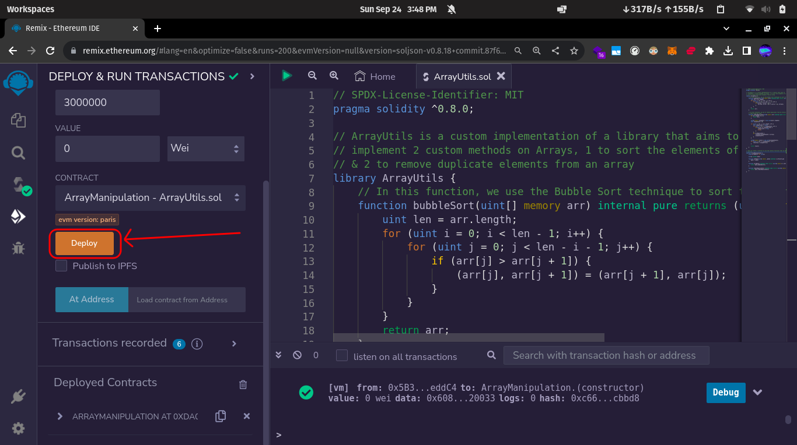
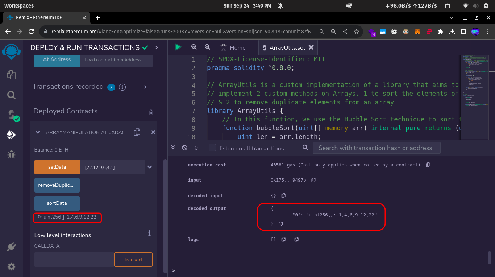
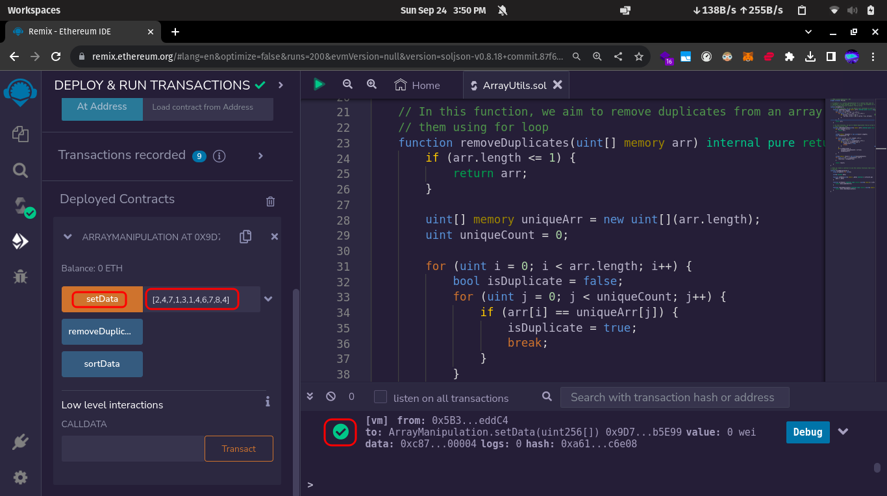
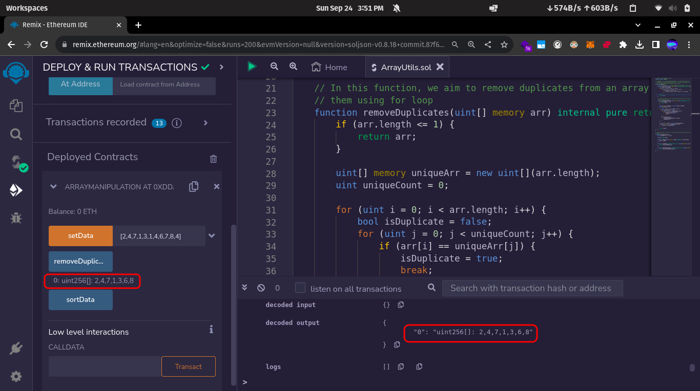

 Instructions
-------------

Implement a smart contract that uses a library to handle array manipulations: sorting and removing duplicates. 

Submission Process:
-------------------

- Create Github Repo.
- Add your Solidity files.
- ReadMe file should contain the screenshots of Remix with the outputs of Sorting and Duplicate functions.
- Provide the Github Repo URL as your submission. 

Solution
--------

*Part-1: Sort the array*

The solution file is attached in the directory as `ArrayUtils.sol`.

- First, we deploy the Contract.

- After this, we feed the input to the function(an unsorted array).

- At last, we find the sorted array as output.

*Part-2: Remove duplicates from the array*

- First, we feed an array to the function with duplicate elements inside.

- After we execute the function, we receive output from the function as an array with no duplicate elements.

