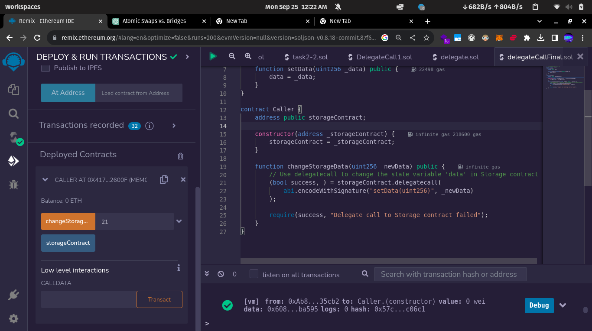
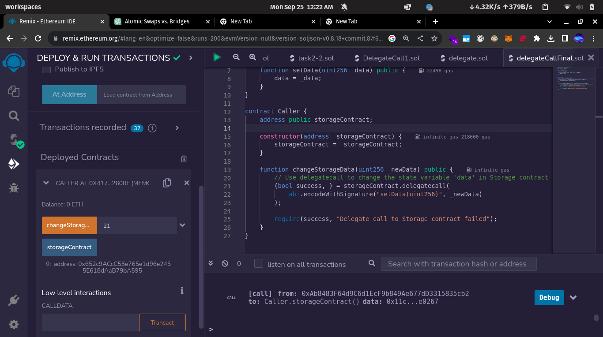

Instructions
------------

1. Write a function to check whether a contract has code or not. Hint: Use assembly function.
2. Implement a smart contract that interacts with another contract via delegate calls to update state variables. Note: Do not use the same example from class.
3. Explain advantages and disadvantages of using atomic swaps and cross-chain bridges.

Submission Rules:
-----------------

- For task 1 & 3, please submit a PDF with the write-up.
- For task 2, use the github repo from Lab 1. Submission should include:
- Solidity File.
- Read Me with a screenshots for outputs from Remix.
- Include comments for each statement in the solidity file to explain the steps.

Solution
----------

- First we deploy the contract.

- After this, we aim to change the state variable of the contract by using the changeStorageData()

